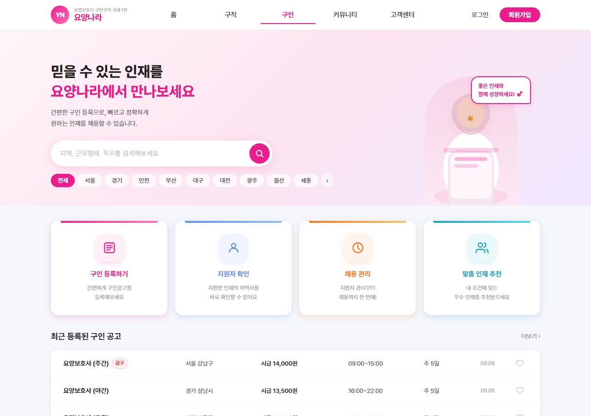
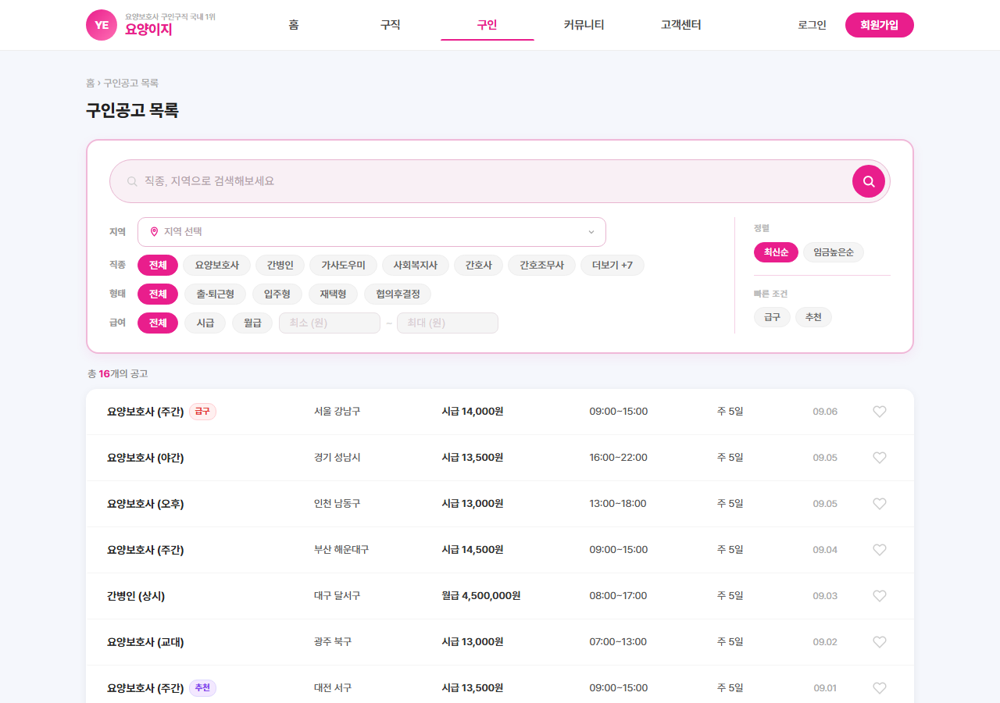
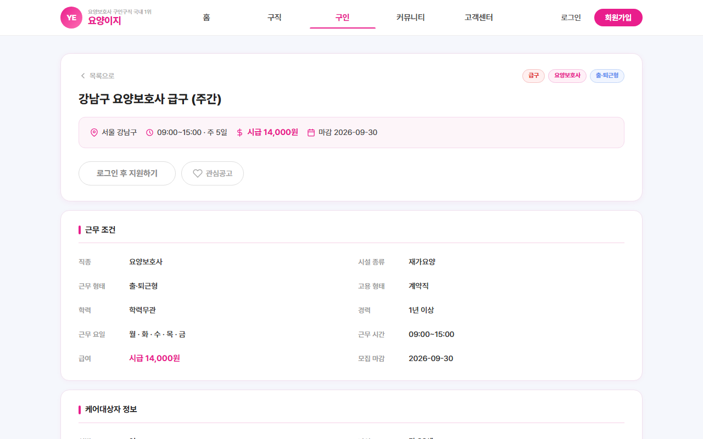
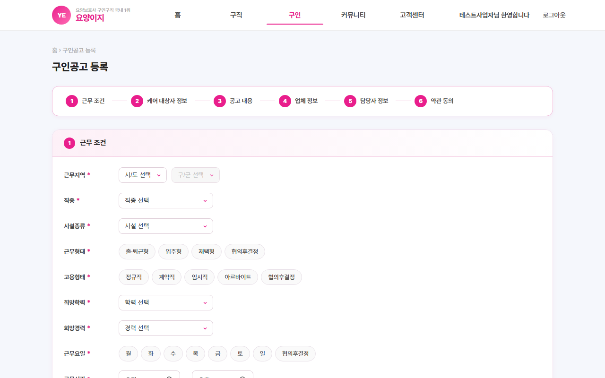
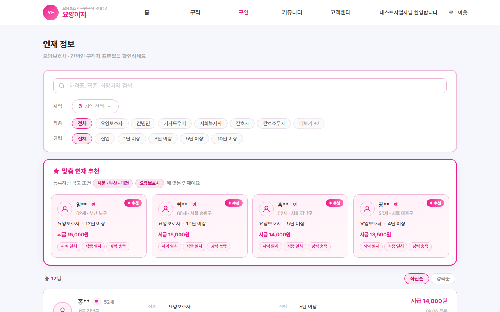
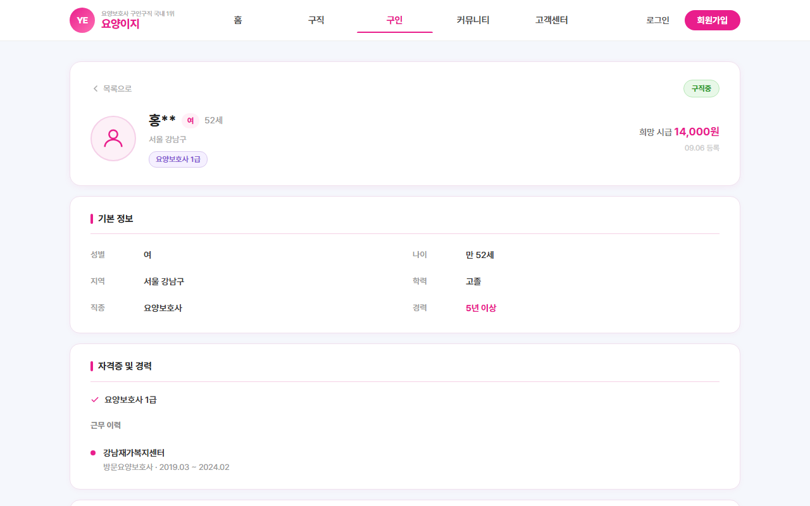
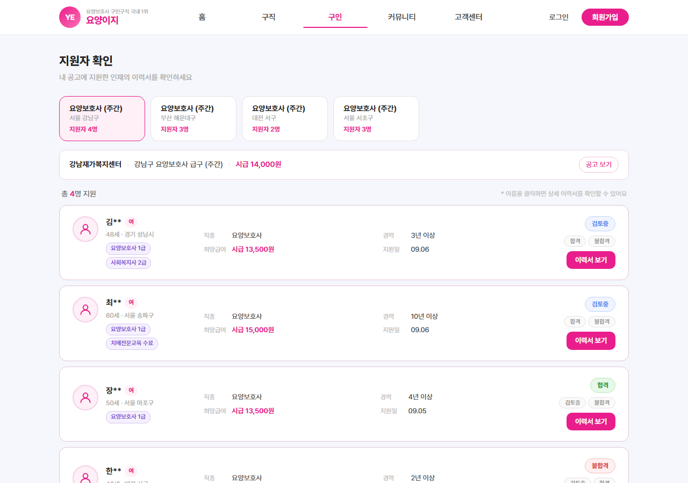
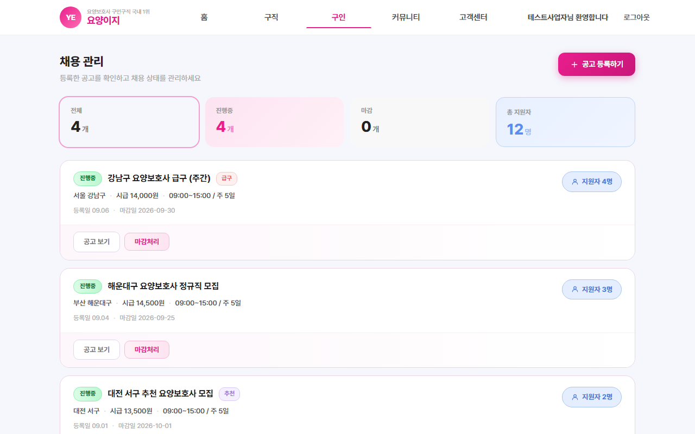
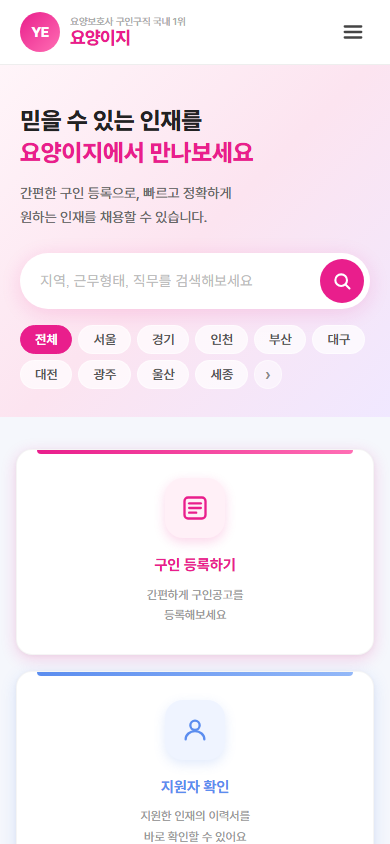
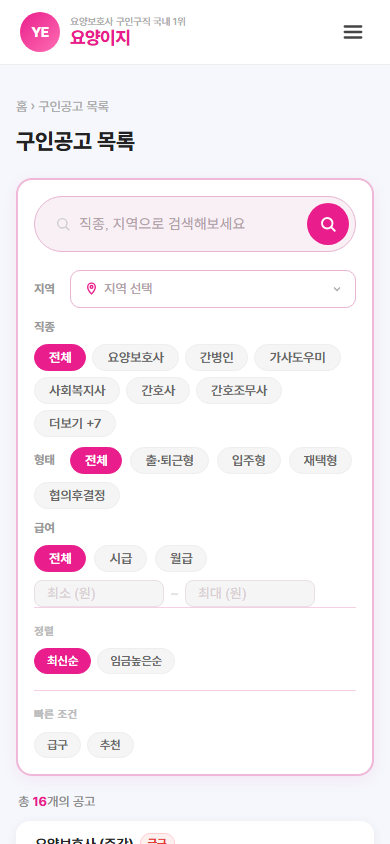

# 요양이지 (YoYang Easy)

요양보호사 구인구직을 위한 전문 플랫폼입니다.  
구인 업체와 구직 요양보호사를 빠르고 쉽게 연결합니다.

---

## 주요 기능

| 기능 | 설명 |
|------|------|
| 구인공고 목록 | 지역·직종·근무형태·급여 필터, 내 구인공고 섹션 |
| 구인공고 등록 | 케어 조건, 급여, 마감일 등 상세 공고 작성 |
| 구인공고 상세 | 공고 세부 정보 확인 및 바로지원 |
| 인재 정보 | 지역·직종·경력 필터 + 맞춤 인재 추천 |
| 인재 상세 | 자격증, 경력, 희망조건, 자기소개 확인 |
| 지원자 확인 | 공고별 지원자 목록 및 합격·불합격 상태 관리 |
| 채용 관리 | 전체·진행중·마감 필터, 마감·재개 처리 |
| 페이지 접근 제한 | 구인자 전용 페이지 AuthGuard 적용 |
| 로그인 상태 분기 | 사용자 타입별 UI 차별화 |
| 모바일 반응형 | 전 페이지 햄버거 메뉴 포함 반응형 레이아웃 |
| 홈 검색 연동 | 히어로 검색·지역 다중선택 → 공고 목록 필터 자동 적용 |

---

## 화면 구성

### 홈


### 구인공고 목록


### 구인공고 상세


### 구인공고 등록


### 인재 정보


### 인재 상세


### 지원자 확인


### 채용 관리


### 모바일
| 홈 | 공고 목록 |
|---|---|
|  |  |

---

## 기술 스택

| 구분 | 기술 |
|------|------|
| Frontend | React 18 + Vite |
| Routing | React Router DOM v6 |
| Styling | CSS (컴포넌트별) |
| 인증 상태 | AuthContext (전역 공유) |
| 주소검색 | 카카오 우편번호 API |

---

## 실행 방법

```bash
cd frontend
npm install
npm run dev
```

브라우저에서 `http://localhost:5173` 접속  
백엔드 API는 `http://localhost:8080` 에서 실행 필요

---

## 작업 로그

### 2026-09-09
- 인재정보 리스트뷰 결과바와 컬럼 헤더 사이 여백 추가
- 헤더 '구직' 메뉴 클릭 시 /jobseeker 페이지로 연결

---

## 폴더 구조

```
frontend/src/
├── components/     # 공통 컴포넌트 (Header, Footer, AuthGuard 등)
├── contexts/       # AuthContext (전역 인증 상태)
├── hooks/          # useAuth
├── pages/          # 페이지 컴포넌트
├── data/           # 목 데이터 (jobs, talents, applicants)
└── api.js          # 백엔드 API 연동
```
