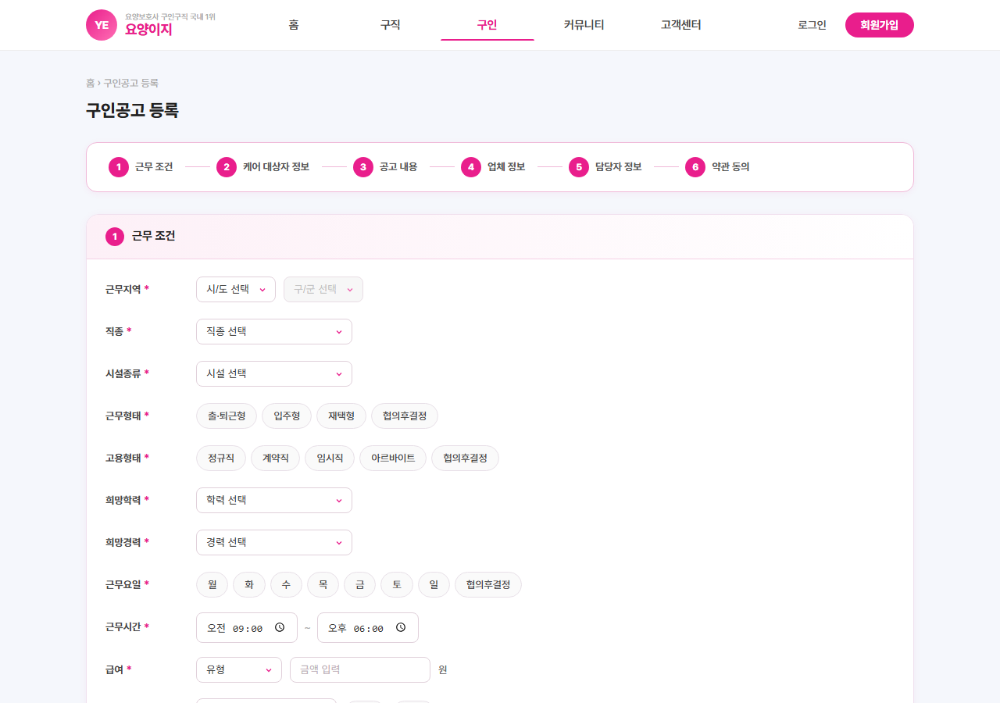

# 요양이지 (Caregiver)

요양보호사 구인구직 플랫폼 프론트엔드 프로젝트입니다.

## 주요 페이지

### 홈


### 구인공고 목록


### 구인공고 등록


### 인재 정보


## 기술 스택

- React + Vite
- React Router DOM
- CSS (컴포넌트별 모듈)

## 실행 방법

```bash
cd frontend
npm install
npm run dev
```
